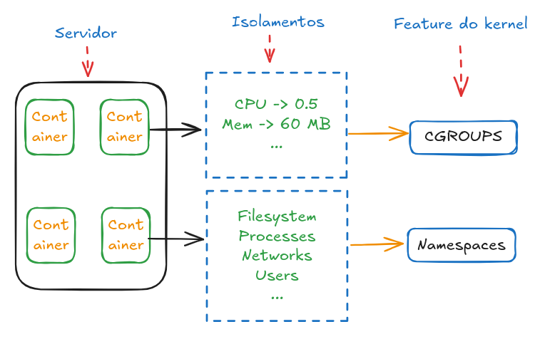

# O que é um container?[^1]

Os contêineres são processos isolados para cada um dos componentes do seu aplicativo. Cada componente é executado em seu próprio ambiente isolado, completamente isolado de todo o resto em sua máquina.

Os contêineres são:

- **Autônomos**: Cada contêiner tem tudo o que precisa para funcionar sem depender de nenhuma dependência pré-instalada na máquina host.

- **Isolados**: Como os contêineres são executados isoladamente, eles têm influência mínima no host e em outros contêineres, aumentando a segurança dos seus aplicativos.

- **Independentes**: Cada contêiner é gerenciado de forma independente. A exclusão de um contêiner não afetará nenhum outro.

- **Portáteis**: Os contêineres podem funcionar em qualquer lugar! O contêiner executado em sua máquina de desenvolvimento funcionará da mesma maneira em um data center ou em qualquer lugar da nuvem!
    
Fonte: 

 

# Namespaces e Cgroups

Os **namespaces** do Linux fornecem isolamento para processos em execução, limitando seu acesso aos recursos do sistema sem que o processo em execução esteja ciente das limitações.

Um **grupo de controle (cgroup)** é um recurso do kernel Linux que limita, contabiliza e isola o uso de recursos (CPU, memória, E/S de disco, rede e assim por diante) de uma coleção de processos.

Fonte: [Isolate containers with a user namespace](https://docs.docker.com/engine/security/userns-remap/)   
Fonte: [What Are Namespaces and cgroups, and How Do They Work?](https://blog.nginx.org/blog/what-are-namespaces-cgroups-how-do-they-work)

 

## Fontes
[^1]: [What is a container?](https://docs.docker.com/get-started/docker-concepts/the-basics/what-is-a-container/)
