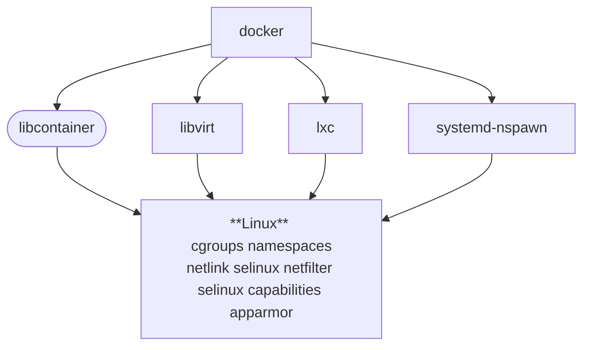

# Docker Internals

O Docker utiliza algumas features básicas do kernel Linux para o seu funcionamento. A seguir temos um diagrama no qual é possível visualizar os modulos do kernel de que o Docker faz uso:

