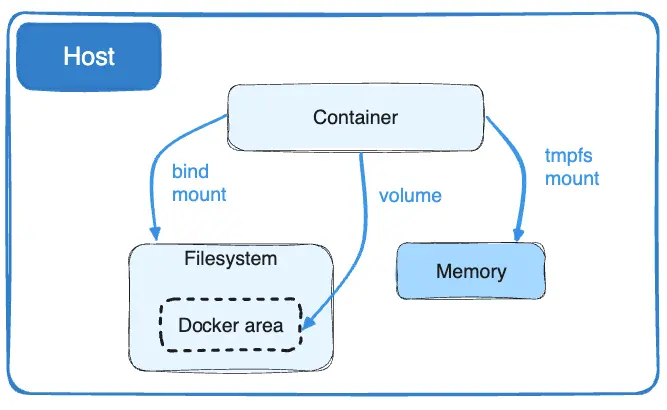

# O que são volumes e seus tipos

 

Um **volume** é o mapeamento de um diretório de um host para dentro de um container fazendo com que seus dados se tornem persistentes.

Existem 03 tipos de volume:

- **bind**: Monta um diretório existente no host para um diretório dentro do container.
- **volume**: Totalmente gerenciado pelo Docker. Por padrão os volumes, no host, ficam no diretório `/var/lib/docker/volumes/`.
- **tmpfs**: Um volume **tmpfs** é temporário e persiste apenas na memória do host. Quando o contêiner para, o volume **tmpfs** é removido e os arquivos gravados não serão persistidos. Isso é útil para armazenar temporariamente arquivos confidenciais que você não deseja persistir no host ou na camada gravável do contêiner. Só funciona se o Docker estiver sendo executado em Linux. E, este tipo de volume, não é possível ser compartilhado entre containers.

 

 

## Saiba mais
[Docker: tmpfs mounts](https://docs.docker.com/engine/storage/tmpfs/)
