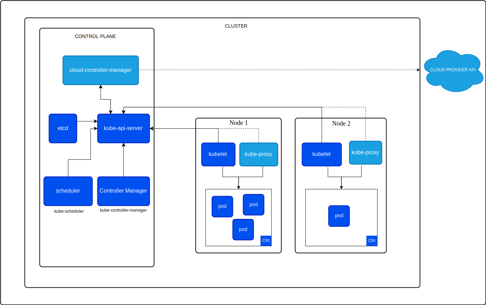

# O que são os workers e o control plane do Kubernetes?[^1]

Um cluster **Kubernetes** consiste em um **Control Plane** mais um conjunto de **Workers**, chamados **Nodes** (nós), que executam aplicativos em containers. Cada cluster precisa de pelo menos um node de Worker para executar **Pods**.

Os **Nodes Worker** hospedam os Pods que são os componentes do workload do aplicativo.

O **Control Plane** gerencia os Nodes Worker e os Pods em um Cluster. Em um ambiente de produção, o **Control Plane**, geralmente, é executado através de múltiplos computadores e um cluster, geralmente, executa múltiplos Nodes, proporcionando tolerância a falhas e alta disponibilidade.

 

 

O diagrama da Figura acima apresenta um exemplo de arquitetura de referência para um cluster **Kubernetes**. A distribuição real dos componentes pode variar com base nas configurações e requisitos específicos do cluster.

No diagrama, cada **Node** executa o componente **kube-proxy**. Você precisa de um componente **kube-proxy** em cada **Node** para garantir que a Service API e os comportamentos associados estejam disponíveis na rede do cluster. No entanto, alguns plug-ins de rede fornecem sua própria implementação de proxy de terceiros. Quando você usa esse tipo de plugin de rede, o nó não precisa executar o **kube-proxy**.

## Fontes
[^1]: [Kubernetes: Cluster Architecture](https://kubernetes.io/docs/concepts/architecture/)

https://kubernetes.io/docs/concepts/architecture/